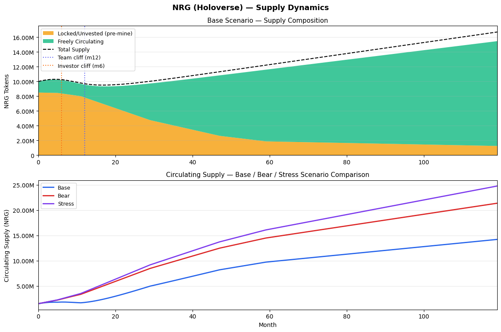
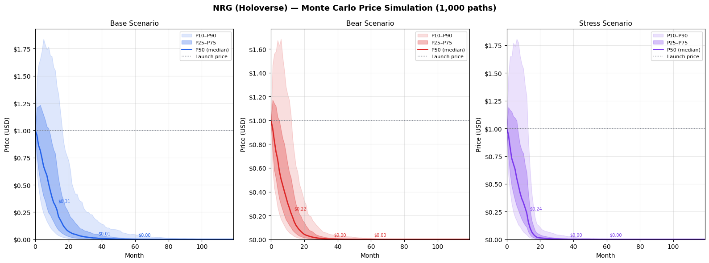
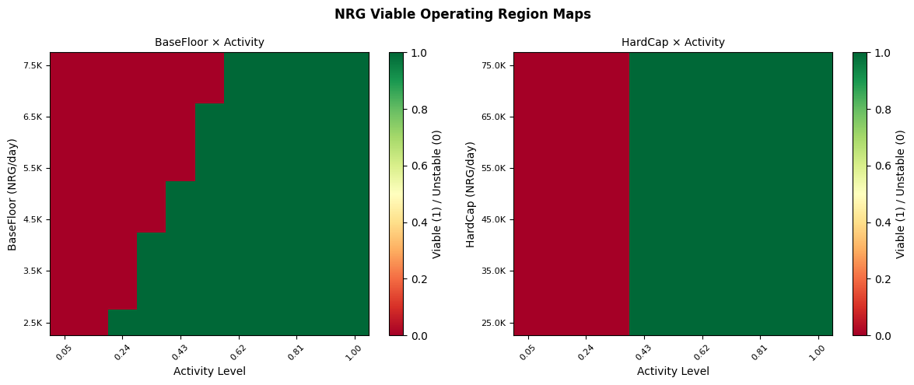

# Tokenomics Analyzer

**Systematic token economic analysis. 51 risk checks, quantitative simulations, concrete fix proposals.**

Most token models fail in predictable ways: emission shocks, death spirals, insider concentration, governance capture, treasury collapse. The patterns are well-documented. What's rare is finding them rigorously — before launch, with enough specificity to actually fix them.

This is a Claude Code agent that does exactly that. Submit your token model in any format and it runs a structured 7-step analysis: parsing, archetype classification, weakness scanning, quantitative simulation, and a full written report with grade and fix proposals.

---

## What you get

| Deliverable | Description |
|---|---|
| **Parsed TokenModel** | Your model converted to structured YAML — a precise representation of every supply, vesting, governance, and treasury parameter |
| **Completeness scorecard** | Gap assessment before analysis begins; targeted follow-up questions for anything missing |
| **Weakness scan** | 51 checks across 5 severity levels, grounded in real failure postmortems; every Critical and High finding includes a specific, implementable fix proposal |
| **Simulations** | Supply curves, Monte Carlo price bands (1,000 paths), parameter sensitivity heatmaps, death spiral stress tests, viable operating region maps |
| **Written report** | A–F grade with justification, system dynamics analysis, equilibrium conditions, sustainability requirements, and optimization roadmap |

---

## How it reasons

The analysis draws simultaneously from seven frameworks:

- **Mechanism design** — are the incentives actually compatible across all participant types?
- **Evolutionary game theory** — are the equilibria stable under adversarial pressure?
- **Complex systems science** — where are the phase transitions and tipping points?
- **Institutional economics** — does the governance design meet Ostrom's criteria for sustainable commons?
- **Platform economics** — how do network effects and bootstrapping dynamics interact with token incentives?
- **Monetary theory** — what are the seigniorage dynamics and monetary policy analogs?
- **Financial economics** — what are the embedded options and stochastic supply dynamics?

Findings, grades, and fix proposals are outputs of this analysis — not a checklist applied mechanically.

---

## Knowledge base

The agent loads domain knowledge selectively based on your token's features:

| File | Covers |
|---|---|
| `token_archetypes.md` | 7 archetypes with classification decision tree and failure patterns |
| `failure_postmortems.md` | Terra/LUNA, Iron Finance, OHM, Anchor, Basis Cash; 10-condition death spiral checklist |
| `failure_postmortems_2024.md` | Stream Finance/xUSD, Compound governance capture, leverage stablecoin patterns |
| `staking_dynamics.md` | Issuance formulas, reflexivity loop, staking equilibrium model |
| `governance_attacks.md` | Beanstalk, Tornado Cash, Build Finance; 22-item governance attack checklist |
| `vetokens_and_emissions.md` | veCRV mechanics, Solidly failure, emission decay curves, bribe market dynamics |
| `treasury_design.md` | Runway formula, diversification benchmarks, protocol-owned liquidity |
| `fee_economics.md` | Fee capture ratio, revenue taxonomy, unit economics benchmarks |
| `token_velocity.md` | MV=PQ framework, velocity trap, sink mechanism effectiveness |
| `reference_benchmarks.md` | Live comparison data: BTC / ETH / UNI / CRV / GMX / stETH |

---

## Sample outputs

### Supply dynamics and vesting schedule

<p align="center">
  
</p>

Supply composition over time with vesting cliff markers, showing freely circulating vs. locked supply and Base / Bear / Stress scenario comparison.

---

### Monte Carlo price simulation — 1,000 paths

<p align="center">
  
</p>

Price bands (P10–P90) across Base, Bear, and Stress scenarios over a 9-year horizon, surfacing dilution risk and emission-driven sell pressure windows.

---

### Viable operating region

<p align="center">
  
</p>

Parameter space maps showing which combinations of design parameters keep the system stable (green) vs. drive it toward collapse (red). Used to derive concrete sustainability thresholds.

---

## How to submit your model

See [`SUBMISSION_GUIDE.md`](SUBMISSION_GUIDE.md) — any format is accepted (prose, bullet points, whitepaper section, spreadsheet). No form to fill out.

---

## Running the analyzer

**Prerequisites:** [Claude Code](https://claude.ai/code) and Python 3.10+

```bash
pip install -r requirements.txt
```

Open a Claude Code session in this directory and use the slash commands:

```
/audit path/to/your-token-model.md     # full pipeline: parse → scan → simulate → report
/audit "describe your token here"      # same, from a verbal description

/assess-model "..."                    # completeness check only — scorecard + gap questions
/parse-model "..."                     # parse to structured YAML, no full audit
/simulate models/my-token.yaml        # run simulations for an existing parsed model
/stress-test models/my-token.yaml     # adversarial scenarios: bear market, whale exit, revenue collapse
/benchmark models/my-token.yaml       # comparison table against comparable protocols
```

Outputs are saved to:

| Artifact | Location |
|---|---|
| Parsed model | `models/<token-name>.yaml` |
| Scan trace | `analysis/<token-name>/scan_trace.md` |
| Charts and CSVs | `analysis/<token-name>/` |
| Report (markdown) | `reports/<token-name>_audit.md` |
| Report (PDF) | `reports/<token-name>_audit.pdf` |

---

## Status

| Component | Status |
|---|---|
| Knowledge base — 15 domain files | ✅ Complete |
| Schema, report template, slash commands | ✅ Complete |
| Weakness scanner — 51 flags across 5 severities | ✅ Complete |
| Completeness assessment | ✅ Complete |
| Core simulation suite — supply, Monte Carlo, sensitivity, death spiral | ✅ Complete |
| PDF report generation | ✅ Complete |
| Extended simulation suite — staking, velocity, agent-based, governance | 🔧 In progress |
| Excel financial model generator | 🔧 Planned |
| Extended knowledge base — GameFi / NFT / theoretical foundations | 🔧 Planned |

---

## Stack

```
Python: numpy, pandas, matplotlib, scipy, openpyxl, jinja2, weasyprint, pyyaml
Agent:  Claude Code (claude-sonnet-4-6 or later)
```
